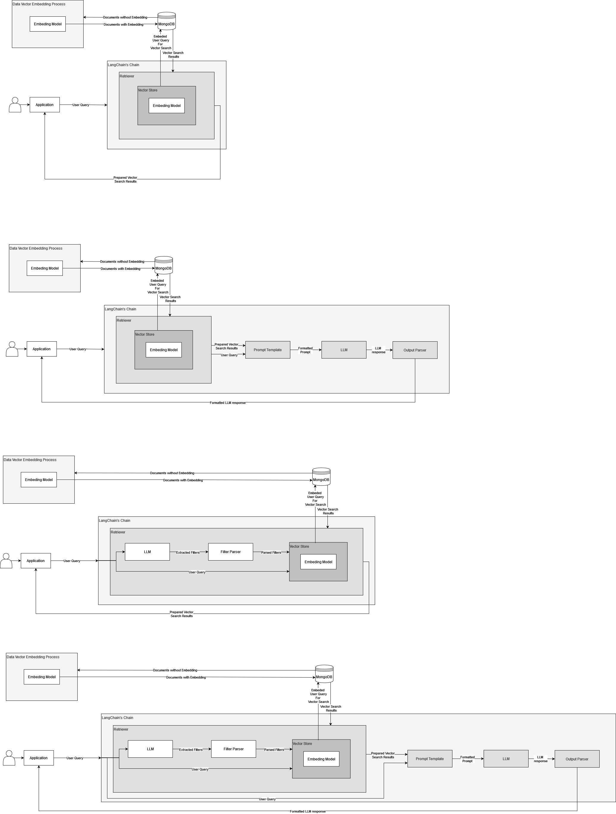

# LLM-RAG API

A Flask-based application providing multiple endpoints for performing vector searches and Retrieval-Augmented Generation (RAG) using MongoDB and LangChain. The application leverages embeddings for document retrieval and query augmentation.

## Table of Contents

- [LLM-RAG API](#llm-rag-api)
  - [Table of Contents](#table-of-contents)
  - [About the Project](#about-the-project)
  - [Features](#features)
  - [Technologies Used](#technologies-used)
  - [Software Architecture](#software-architecture)
  - [Project Structure](#project-structure)
  - [Setup and Installation](#setup-and-installation)
  - [Usage](#usage)
    - [Hello World](#hello-world)
    - [Vector Search](#vector-search)
    - [RAG](#rag)
    - [Self-Querying Vector Search](#self-querying-vector-search)
    - [Self-Querying RAG](#self-querying-rag)
  - [Example](#example)
  - [Contributors](#contributors)

## About the Project

**Course:** Open Learning  
**Semester:** 6

This project was developed as part of coursework in Open Learning. It aims to provide a scalable API for vector search and RAG tasks using MongoDB, Flask, and LangChain, facilitating efficient document retrieval and query augmentation.

## Features

- Vector Search
- Retrieval-Augmented Generation
- Self-Querying Vector Search
- Self-Querying Retrieval-Augmented Generation

## Technologies Used

- **Programming Languages/Technologies:**
  - Python
- **Libraries/Frameworks:**
  - Flask
  - LangChain
- **Database:**
  - MongoDB
- **Tools:**
  - Large Language Models (LLMs)

## Software Architecture

The application is designed as RESTful microservice with endpoints for vector search and RAG. MongoDB is used for data storage, and LangChain facilitates interaction with language models and embeddings.



## Project Structure

```
llm-rag-api/
│
├── misc/               # Helper functions
│
├── rag/                # Customised RAG implementation
│
├── README.md           # Project documentation
├── app.py              # Flask API endpoints
└── requirements.txt    # List of dependencies
```

## Setup and Installation

Follow the instructions below to set up the project on your local machine.

1. **Clone the Repository:**

   ```bash
   git clone https://github.com/grzgm/llm-rag-api
   cd llm-rag-api
   ```

2. **Install Dependencies:**

   ```bash
   pip install -r requirements.txt
   ```

3. **Configure Environment Variables:**
   Copy the contents of `.env.example` to a `.env` file in the project root and populate it with the necessary environment variables:

   ```
   MONGO_URI=<your_mongodb_uri>
   DB_NAME=<your_database_name>
   COLL_NAME=<your_collection_name>
   INDEX_NAME=<your_index_name>
   EMBEDDING_KEY=<your_embedding_key>
   DOCUMENT_CONTENT_DESCRIPTION=<document_content_description>
   ```

4. **Run the Flask Application:**
   ```bash
   flask run
   ```

## Usage

### Hello World

- **URL:** `/`
- **Method:** `GET`
- **Description:** Returns a simple greeting message to ensure the server is running.
- **Parameters:** None
- **Response:**
  ```html
  <p>Hello, World!</p>
  ```

### Vector Search

- **URL:** `/vector-search`
- **Method:** `GET`
- **Description:** Performs a vector search on the MongoDB collection.
- **Parameters:**

| Parameter    | Type        | Required | Description                                 |
| ------------ | ----------- | -------- | ------------------------------------------- |
| `query`      | string      | Yes      | The query to search for.                    |
| `projection` | JSON string | No       | Custom projection for the MongoDB query.    |
| `docs_num`   | integer     | No       | Number of documents to return (default: 3). |

- **Response:** JSON array of documents matching the search query.

### RAG

- **URL:** `/rag`
- **Method:** `GET`
- **Description:** Performs a RAG operation to retrieve documents and generate responses based on the query.
- **Parameters:**

| Parameter    | Type        | Required | Description                                 |
| ------------ | ----------- | -------- | ------------------------------------------- |
| `query`      | string      | Yes      | The query to search for.                    |
| `projection` | JSON string | No       | Custom projection for the MongoDB query.    |
| `docs_num`   | integer     | No       | Number of documents to return (default: 3). |

- **Response:** JSON object containing the RAG-generated response.

### Self-Querying Vector Search

- **URL:** `/sq-vector-search`
- **Method:** `GET`
- **Description:** Performs a self-querying vector search, which automatically generates filters based on the query.
- **Parameters:**

| Parameter    | Type        | Required | Description                                 |
| ------------ | ----------- | -------- | ------------------------------------------- |
| `query`      | string      | Yes      | The query to search for.                    |
| `projection` | JSON string | No       | Custom projection for the MongoDB query.    |
| `docs_num`   | integer     | No       | Number of documents to return (default: 3). |

- **Response:** JSON array of documents matching the search query with auto-generated filters.

### Self-Querying RAG

- **URL:** `/sq-rag`
- **Method:** `GET`
- **Description:** Performs a self-querying RAG operation to retrieve documents and generate responses based on the query with auto-generated filters.
- **Parameters:**

| Parameter    | Type        | Required | Description                                 |
| ------------ | ----------- | -------- | ------------------------------------------- |
| `query`      | string      | Yes      | The query to search for.                    |
| `projection` | JSON string | No       | Custom projection for the MongoDB query.    |
| `docs_num`   | integer     | No       | Number of documents to return (default: 3). |

- **Response:** JSON object containing the self-querying RAG-generated response.

## Example

To use the endpoints, send HTTP GET requests with the appropriate parameters to the Flask server. For example, to perform a vector search, use the following curl command:

```bash
curl -G \
  --data-urlencode "query=your_search_query" \
  --data-urlencode "projection={\"field\": 1}" \
  --data-urlencode "docs_num=5" \
  http://localhost:5000/vector-search
```

Make sure to adjust the parameters as needed.

## Contributors

- [Grzegorz Malisz](https://github.com/grzgm): Author.
